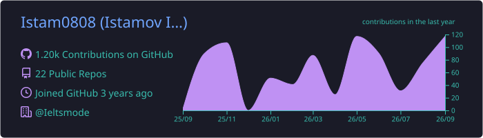
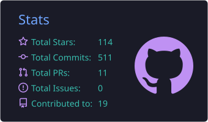
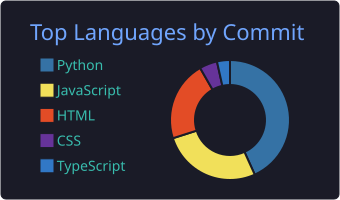

<!-- ============ HEADER ============ -->

  

  

  
  
  
  

<!-- ============ ABOUT ============ -->
## 👋 About me

- 🏫 Founder of **[fm-it.uz](https://fm-it.uz)** — IT school & learning platform
- 🎯 Co-Founder of **[ieltsmode.com](https://www.ieltsmode.com/)** — mock IELTS platform
- 🧪 Building **[examode](https://examode.uz)** — CEFR exam platform for learning centers
- ⚡ Full-stack: **Next.js + Django DRF** is my daily stack
- 🌱 Learning **System Design** and **Microservices**
- 💬 Ask me about **Web Dev, EdTech, Career in IT**
- 🗣️ Uzbek · Русский · English
- 💼 Open to freelance — [Upwork](https://www.upwork.com/freelancers/~01d1eae8cce723af0d) · [Kwork](https://kwork.ru/user/mamadaliyevistam)

<!-- ============ STACK ============ -->
## 🛠️ Tech stack

  <b>Frontend</b>  
  

  <b>Backend & Data</b>  
  

  <b>DevOps & Tools</b>  
  

<!-- ============ ANALYTICS ============ -->
## 📊 GitHub analytics

<!-- Карточки генерирует GitHub Action (.github/workflows/profile.yml) прямо в этот репозиторий,
     поэтому они не зависят от перегруженных публичных Vercel-инстансов -->

  

  
  

  

<!--
  Если хочешь вернуть классические карточки github-readme-stats — задеплой свой инстанс
  (Fork https://github.com/anuraghazra/github-readme-stats → Import в Vercel → env PAT_1 = твой токен)
  и замени домен ниже на свой:
  
-->

<!-- ============ SNAKE ============ -->

  <picture>
    <source media="(prefers-color-scheme: dark)" srcset="https://raw.githubusercontent.com/Istam0808/Istam0808/output/snake-dark.svg" />
    <source media="(prefers-color-scheme: light)" srcset="https://raw.githubusercontent.com/Istam0808/Istam0808/output/snake.svg" />
    
  </picture>

<!-- ============ CONTACTS ============ -->
## 📫 Let's connect

  
  
  
  
  
  

  

